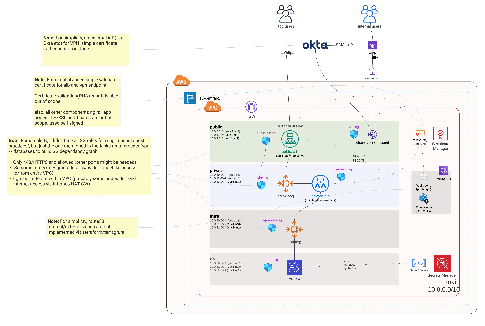

### High level solution
[](AWS_HLD.png)

### Terragrunt project structure 
modules and their execution order for single region:
```
Group 1
- Module ./certificates/wildcard
- Module ./compute/ssh-keys/ec2-key
- Module ./network/vpc/main

Group 2
- Module ./network/security-groups/public-alb
- Module ./network/security-groups/vpn

Group 3
- Module ./compute/elb/public-alb
- Module ./network/security-groups/web-node
- Module ./network/vpn/vpn-endpoint

Group 4
- Module ./compute/asg/web
- Module ./network/security-groups/private-alb

Group 5
- Module ./compute/elb/private-alb
- Module ./network/security-groups/app-node

Group 6
- Module ./compute/asg/app
- Module ./network/security-groups/aurora-db

Group 7
- Module ./rds/aurora
```

#### Apply
```
# Step 1: 
cd to the account/region folder (e.g payabl/eu-central-1)

# Step 2: 
terrgurnt run-all init 

# Step 3: 
terrugrunt run-all plan
terrugrunt run-all apply
```

### Clean up cache directories
```
# Find all .terragrunt-cache folders
find . -type d -name ".terragrunt-cache"

# Delete all .terragrunt-cache folders
find . -type d -name ".terragrunt-cache" -prune -exec rm -rf {} \;
```

NOTE: sometime vpn-endpoint creation fails because of timeout(related to Certificate validation). To fix, re-run `terragrunt apply` 